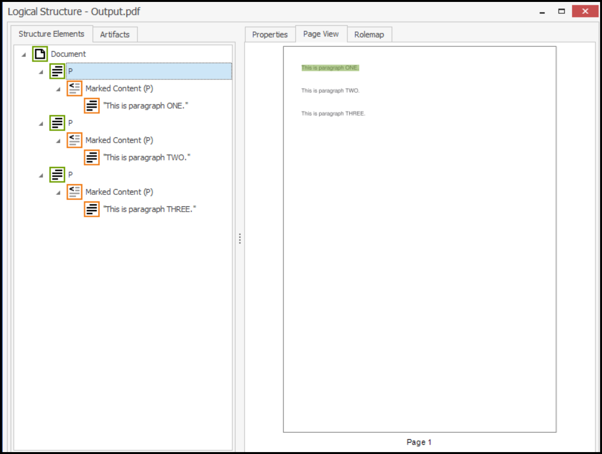
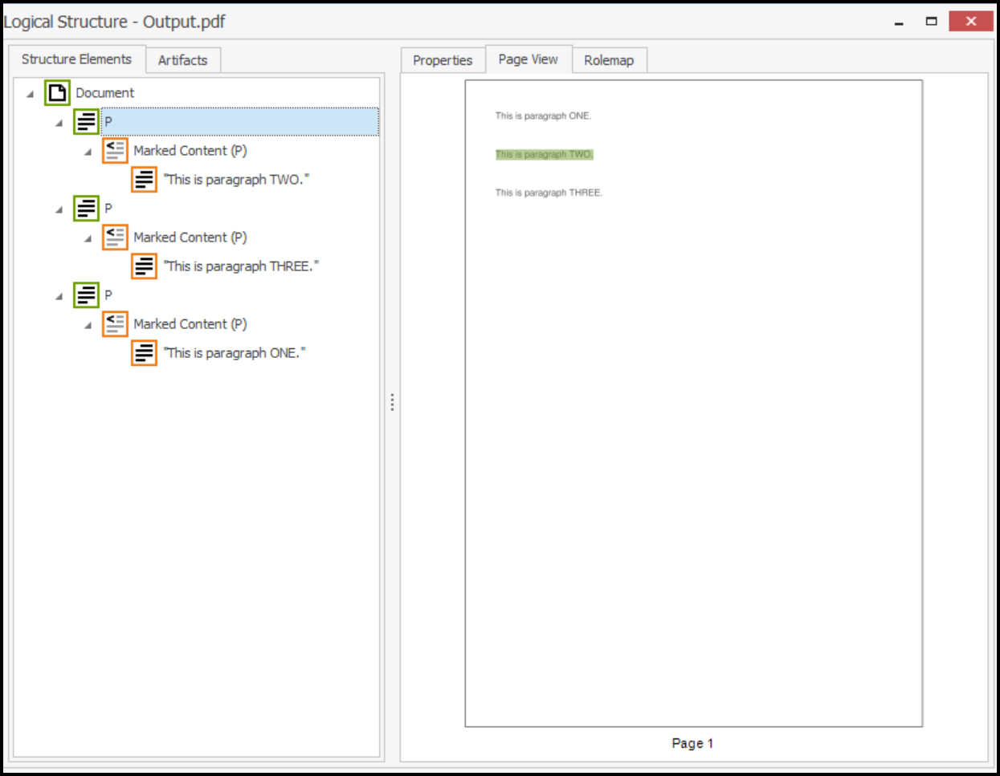
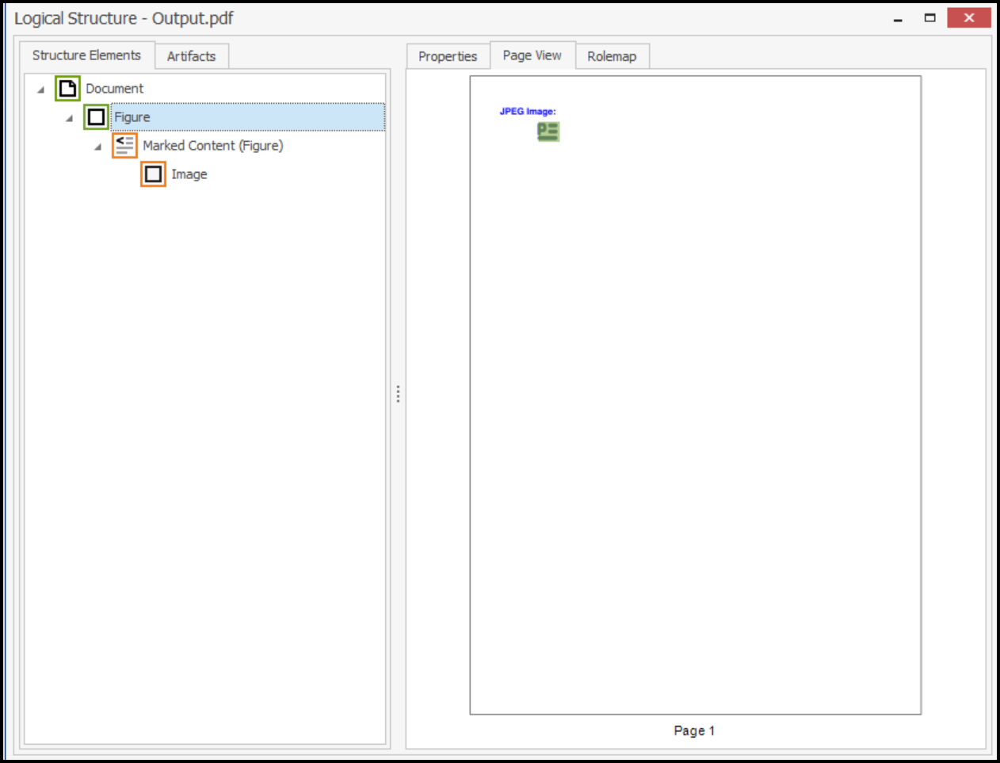

# How to Create Accessible PDF Documents in .NET using the Syncfusion&reg; PDF Library

## Introduction
A quick start .NET console project that shows how to create accessible PDF documents using the Syncfusion&reg; PDF Library.

## System requirement
**Framework and SDKs**
* .NET SDK (version 5.0 or later)

**IDEs**
*  Visual Studio 2019/ Visual Studio 2022

## Code snippet for Auto Tagging a new document
We will create a new .NET console application, add the Syncfusion&reg; PDF library package, and write the code

```csharp
//Creates new PDF document.
PdfDocument document = new PdfDocument();
//Set true to auto tag all elements in document.
document.AutoTag = true;
//Set the document information title. 
document.DocumentInformation.Title = "AutoTag";
//Add a new page to the document.
PdfPage page = document.Pages.Add();
//Creates new text element.
PdfTextElement element = new PdfTextElement("This is paragraph ONE.", new PdfStandardFont(PdfFontFamily.Helvetica, 12));
//Set the brush for text element. 
element.Brush = new PdfSolidBrush(new PdfColor(89, 89, 93));
//Draw the text element in PDF page.  
element.Draw(page, new RectangleF(0, 0, page.Graphics.ClientSize.Width / 2, 200));
//Creates new text element.
PdfTextElement element1 = new PdfTextElement("This is paragraph TWO.", new PdfStandardFont(PdfFontFamily.Helvetica, 12));
//Set the brush for text element. 
element1.Brush = new PdfSolidBrush(new PdfColor(89, 89, 93));
//Draw the next element in PDF page. 
element1.Draw(page, new RectangleF(0, 50, page.Graphics.ClientSize.Width / 2, 200));
//Creates new text element.
PdfTextElement element2 = new PdfTextElement("This is paragraph THREE.", new PdfStandardFont(PdfFontFamily.Helvetica, 12));
//Set the brush for text element. 
element2.Brush = new PdfSolidBrush(new PdfColor(89, 89, 93));
//Draw the next element in PDF page. 
element2.Draw(page.Graphics, new PointF(0, 100));

//Create file stream.
using (FileStream outputFileStream = new FileStream("Output.pdf", FileMode.Create, FileAccess.ReadWrite)) {
    //Save the PDF document to file stream.
    document.Save(outputFileStream);
}
//Close the document.
document.Close(true);
```

**Output Image**


## Code snippet for Order the tagged elements in a PDF document
We will create a new .NET console application, add the Syncfusion&reg; PDF library package, and write the code

```csharp
//Create a new PDF document.
PdfDocument document = new PdfDocument();
//Sets document title.
document.DocumentInformation.Title = "Order";
//Add a new page to the document.
PdfPage page = document.Pages.Add();
//Initialize the structure element with tag type paragraph.
PdfStructureElement structureElement = new PdfStructureElement(PdfTagType.Paragraph);
//Order the tag in third position.
structureElement.Order = 3;
//Create the text element. 
PdfTextElement element = new PdfTextElement("This is paragraph ONE.", new PdfStandardFont(PdfFontFamily.Helvetica, 12));
//Set the text element brush. 
element.Brush = new PdfSolidBrush(new PdfColor(89, 89, 93));
//Adding tag to the text element.
element.PdfTag = structureElement;
//Draw the text element. 
element.Draw(page, new RectangleF(0, 0, page.Graphics.ClientSize.Width / 2, 200));
//Initialize the structure element with tag type paragraph.
PdfStructureElement paraStruct1 = new PdfStructureElement(PdfTagType.Paragraph);
//Order the tag in first position.
paraStruct1.Order = 1;
//Creates new text element.
PdfTextElement element1 = new PdfTextElement("This is paragraph TWO.", new PdfStandardFont(PdfFontFamily.Helvetica, 12));
//Set the brush for text element. 
element1.Brush = new PdfSolidBrush(new PdfColor(89, 89, 93));
//Adding tag to the text element.
element1.PdfTag = paraStruct1;
//Draw text element in PDF page. 
element1.Draw(page, new RectangleF(0, 50, page.Graphics.ClientSize.Width / 2, 200));
//Initialize the structure element with tag type paragraph.
PdfStructureElement paraStruct2 = new PdfStructureElement(PdfTagType.Paragraph);
//Order the tag in second position.
paraStruct2.Order = 2;
//Creates new text element.
PdfTextElement element2 = new PdfTextElement("This is paragraph THREE.", new PdfStandardFont(PdfFontFamily.Helvetica, 12));
element2.Brush = new PdfSolidBrush(new PdfColor(89, 89, 93));
//Adding tag to the text element.
element2.PdfTag = paraStruct2;
//Draw the next text element in PDF page. 
element2.Draw(page.Graphics, new PointF(0, 100));

//Create file stream.
using (FileStream outputFileStream = new FileStream("Output.pdf", FileMode.Create, FileAccess.ReadWrite)) {
    //Save the PDF document to file stream.
    document.Save(outputFileStream);
}
//Close the document.
document.Close(true);
```

**Output Image**


## Code snippet for Adding tag to image
We will create a new .NET console application, add the Syncfusion&reg; PDF library package, and write the code

```csharp
//Creates new PDF document.
PdfDocument document = new PdfDocument();
//Set the document title.
document.DocumentInformation.Title = "Image";
//Creates new page.
PdfPage page = document.Pages.Add();
//Draw string.
page.Graphics.DrawString("JPEG Image:", new PdfStandardFont(PdfFontFamily.Helvetica, 12, PdfFontStyle.Bold), PdfBrushes.Blue, new PointF(0, 0));
//Load the image as stream.
FileStream imageStream = new FileStream("pdf.jpg", FileMode.Open, FileAccess.Read);
//Create a new PDF bitmap object.
PdfBitmap bitmap = new PdfBitmap(imageStream);
//Set the tag type.
PdfStructureElement imageElement = new PdfStructureElement(PdfTagType.Figure);
//Set the alternate text.
imageElement.AlternateText = "GreenTree";
//adding tag to the PDF image.
bitmap.PdfTag = imageElement;
//Draw image.
bitmap.Draw(page.Graphics, new PointF(50, 20));

//Create file stream.
using (FileStream outputFileStream = new FileStream("Output.pdf", FileMode.Create, FileAccess.ReadWrite)) {
    //Save the PDF document to file stream.
    document.Save(outputFileStream);
}
//Close the document.
document.Close(true);
```

**Output Image**


## How to run the examples
* Download this project to a location in your disk. 
* Open the solution file using Visual Studio. 
* Rebuild the solution to install the required NuGet package. 
* Run the application.

## Resources
*   **Product page:** [Syncfusion&reg; PDF Framework](https://www.syncfusion.com/document-processing/pdf-framework/net)
*   **Documentation page:** [Syncfusion&reg; .NET PDF library](https://help.syncfusion.com/file-formats/pdf/overview)
*   **Online demo:** [Syncfusion&reg; .NET PDF library - Online demos](https://ej2.syncfusion.com/aspnetcore/PDF/CompressExistingPDF#/bootstrap5)
*   **Blog:** [Syncfusion&reg; .NET PDF library - Blog](https://www.syncfusion.com/blogs/category/pdf)
*   **Knowledge Base:** [Syncfusion&reg; .NET PDF library - Knowledge Base](https://www.syncfusion.com/kb/windowsforms/pdf)
*   **EBooks:** [Syncfusion&reg; .NET PDF library - EBooks](https://www.syncfusion.com/succinctly-free-ebooks)
*   **FAQ:** [Syncfusion&reg; .NET PDF library - FAQ](https://www.syncfusion.com/faq/)

## Support and feedback
*   For any other queries, reach our [Syncfusion&reg; support team](https://www.syncfusion.com/support/directtrac/incidents/newincident?utm_source=github&utm_medium=listing&utm_campaign=github-docio-examples) or post the queries through the [community forums](https://www.syncfusion.com/forums?utm_source=github&utm_medium=listing&utm_campaign=github-docio-examples).
*   Request new feature through [Syncfusion&reg; feedback portal](https://www.syncfusion.com/feedback?utm_source=github&utm_medium=listing&utm_campaign=github-docio-examples).

## License
This is a commercial product and requires a paid license for possession or use. Syncfusion’s licensed software, including this component, is subject to the terms and conditions of [Syncfusion's EULA](https://www.syncfusion.com/eula/es/?utm_source=github&utm_medium=listing&utm_campaign=github-docio-examples). You can purchase a licnense [here](https://www.syncfusion.com/sales/products?utm_source=github&utm_medium=listing&utm_campaign=github-docio-examples) or start a free 30-day trial [here](https://www.syncfusion.com/account/manage-trials/start-trials?utm_source=github&utm_medium=listing&utm_campaign=github-docio-examples).

## About Syncfusion
Founded in 2001 and headquartered in Research Triangle Park, N.C., Syncfusion&reg; has more than 26,000+ customers and more than 1 million users, including large financial institutions, Fortune 500 companies, and global IT consultancies.

Today, we provide 1600+ components and frameworks for web ([Blazor](https://www.syncfusion.com/blazor-components?utm_source=github&utm_medium=listing&utm_campaign=github-docio-examples), [ASP.NET Core](https://www.syncfusion.com/aspnet-core-ui-controls?utm_source=github&utm_medium=listing&utm_campaign=github-docio-examples), [ASP.NET MVC](https://www.syncfusion.com/aspnet-mvc-ui-controls?utm_source=github&utm_medium=listing&utm_campaign=github-docio-examples), [ASP.NET WebForms](https://www.syncfusion.com/jquery/aspnet-webforms-ui-controls?utm_source=github&utm_medium=listing&utm_campaign=github-docio-examples), [JavaScript](https://www.syncfusion.com/javascript-ui-controls?utm_source=github&utm_medium=listing&utm_campaign=github-docio-examples), [Angular](https://www.syncfusion.com/angular-ui-components?utm_source=github&utm_medium=listing&utm_campaign=github-docio-examples), [React](https://www.syncfusion.com/react-ui-components?utm_source=github&utm_medium=listing&utm_campaign=github-docio-examples), [Vue](https://www.syncfusion.com/vue-ui-components?utm_source=github&utm_medium=listing&utm_campaign=github-docio-examples), and [Flutter](https://www.syncfusion.com/flutter-widgets?utm_source=github&utm_medium=listing&utm_campaign=github-docio-examples)), mobile ([Xamarin](https://www.syncfusion.com/xamarin-ui-controls?utm_source=github&utm_medium=listing&utm_campaign=github-docio-examples), [Flutter](https://www.syncfusion.com/flutter-widgets?utm_source=github&utm_medium=listing&utm_campaign=github-docio-examples), [UWP](https://www.syncfusion.com/uwp-ui-controls?utm_source=github&utm_medium=listing&utm_campaign=github-docio-examples), and [JavaScript](https://www.syncfusion.com/javascript-ui-controls?utm_source=github&utm_medium=listing&utm_campaign=github-docio-examples)), and desktop development ([WinForms](https://www.syncfusion.com/winforms-ui-controls?utm_source=github&utm_medium=listing&utm_campaign=github-docio-examples), [WPF](https://www.syncfusion.com/wpf-ui-controls?utm_source=github&utm_medium=listing&utm_campaign=github-docio-examples), [WinUI(Preview)](https://www.syncfusion.com/winui-controls?utm_source=github&utm_medium=listing&utm_campaign=github-docio-examples), [Flutter](https://www.syncfusion.com/flutter-widgets?utm_source=github&utm_medium=listing&utm_campaign=github-docio-examples) and [UWP](https://www.syncfusion.com/uwp-ui-controls?utm_source=github&utm_medium=listing&utm_campaign=github-docio-examples)). We provide ready-to-deploy enterprise software for dashboards, reports, data integration, and big data processing. Many customers have saved millions in licensing fees by deploying our software.
